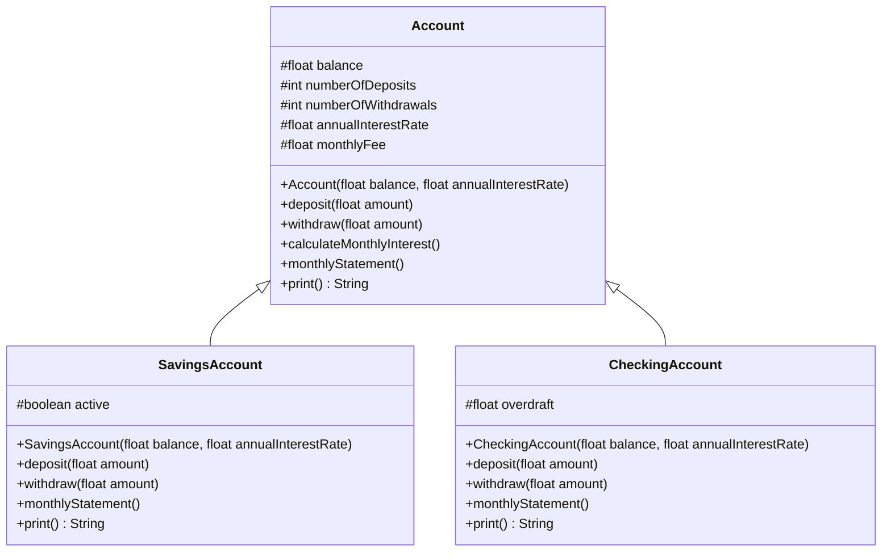

# Cuenta bancaria

Ejercicio individual en Java que modela un sistema de cuentas bancarias aplicando herencia y polimorfismo, con una clase base `Account` y dos clases hijas, `SavingsAccount` y `CheckingAccount`, cada una con su propio comportamiento redefinido.

## Índice

- [Descripción](#descripción)
- [Diagrama de clases](#diagrama-de-clases)
- [Instalación](#instalación)
- [Testing](#testing)
- [Autora](#autora)

## Descripción

El ejercicio consiste en modelar tres clases relacionadas por herencia:

- **`Account`**: clase base con los atributos y operaciones comunes a cualquier cuenta (`balance`, `deposit`, `withdraw`, cálculo de interés mensual, comisión mensual y generación de extracto).
- **`SavingsAccount`**: cuenta de ahorros que hereda de `Account`. Queda inactiva si el saldo cae por debajo de $10.000, y cobra una comisión de $1.000 por cada retiro que supere el quinto en el mes.
- **`CheckingAccount`**: cuenta corriente que hereda de `Account`. Permite retirar más saldo del disponible, generando sobregiro, que se reduce automáticamente con los siguientes depósitos.

## Diagrama de clases



<a href="screenshots/03-class-diagram.png"></a>

## Instalación

Clona el repositorio y entra en la carpeta del proyecto:

```
git clone https://github.com/gmp395/ex-java-cuenta-bancaria.git
cd ex-java-cuenta-bancaria
```

Compila el proyecto con Maven:

```
mvn compile
```

## Testing

El proyecto cuenta con 24 tests unitarios (JUnit 5) que cubren las tres clases, y utiliza JaCoCo para medir la cobertura.

Para ejecutar los tests:

```
mvn test
```

<a href="screenshots/01-test-24-tests-passing.png"></a>

El reporte de cobertura se genera automáticamente en `target/site/jacoco/index.html`. La cobertura obtenida es del 100% en instrucciones y ramas, superando el mínimo exigido del 70%:

<a href="screenshots/02-jacoco-coverage.png"></a>

## Autora

**Gema Miguel** — [GitHub](https://github.com/gmp395)