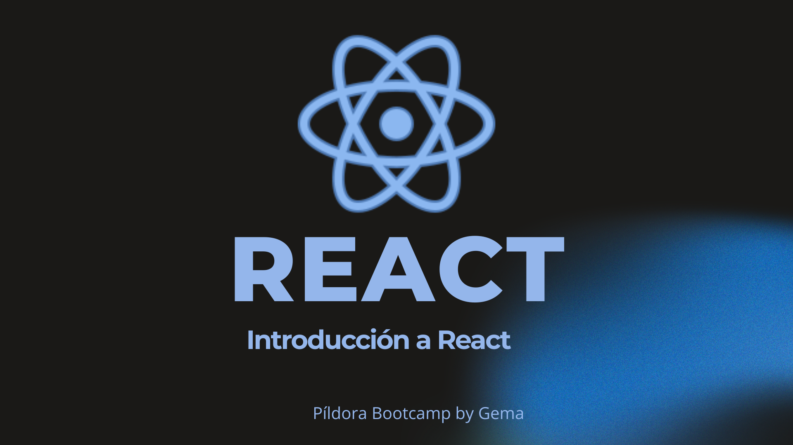

# Píldora formativa: introducción a React

Repositorio creado para una píldora formativa de Frontend sobre React, desarrollada durante una formación intensiva en Desarrollo Web Full Stack.

La exposición combina una introducción teórica a los fundamentos de React con una demostración práctica mediante *live coding*.

## Índice

- [Objetivo](#objetivo)
- [Contenido del repositorio](#contenido-del-repositorio)
- [Conceptos tratados](#conceptos-tratados)
- [Tecnologías utilizadas](#tecnologías-utilizadas)
- [Requisitos previos](#requisitos-previos)
- [Instalación](#instalación)
- [Parte práctica](#parte-práctica)
- [Presentación y guion](#presentación-y-guion)
- [Recursos adicionales](#recursos-adicionales)
- [Autoría](#autoría)

## Objetivo

El objetivo de esta píldora formativa es explicar algunos de los conceptos fundamentales de React mediante una combinación de teoría y práctica.

Durante la exposición se muestra cómo crear una pequeña aplicación utilizando componentes, estado, eventos y renderizado dinámico.

## Contenido del repositorio

```text
pi-react-pill/
├── docs/
│   ├── guion-presentacion.docx
│   ├── guion-presentacion.md
│   ├── react-presentation-cover.png
│   └── react-presentation.pdf
├── public/
├── src/
├── .gitignore
├── eslint.config.js
├── index.html
├── package-lock.json
├── package.json
├── README.md
└── vite.config.js
```

- `src/`: código fuente utilizado durante la demostración práctica.
- `public/`: recursos públicos de la aplicación.
- `docs/react-presentation.pdf`: diapositivas utilizadas durante la exposición.
- `docs/react-presentation-cover.png`: portada de la presentación.
- `docs/guion-presentacion.md`: versión del guion preparada para su lectura en GitHub.
- `docs/guion-presentacion.docx`: versión editable del guion.

## Conceptos tratados

- Componentes.
- JSX.
- Props.
- Gestión de eventos.
- Estado con el hook `useState`.
- Renderizado condicional.
- Renderizado de listas con `map()`.
- Actualización dinámica de la interfaz.
- Funcionamiento general del Virtual DOM.

## Tecnologías utilizadas

- React.
- Vite.
- JavaScript.
- JSX.
- CSS.
- Node.js.
- npm.
- Git y GitHub.

## Requisitos previos

Para ejecutar el proyecto es necesario tener instalados:

- [Node.js](https://nodejs.org/)
- npm, incluido con Node.js
- Git

## Instalación

Clona el repositorio:

```bash
git clone https://github.com/gmp395/pi-react-pill.git
```

Accede a la carpeta del proyecto:

```bash
cd pi-react-pill
```

Instala las dependencias:

```bash
npm install
```

Ejecuta el proyecto en modo desarrollo:

```bash
npm run dev
```

Abre en el navegador la dirección indicada por Vite. Normalmente:

```text
http://localhost:5173
```

## Parte práctica

Durante el *live coding* se desarrolla una pequeña aplicación para demostrar:

1. La creación de componentes.
2. El uso del hook `useState`.
3. La gestión de eventos mediante `onClick`.
4. El renderizado condicional.
5. El renderizado de listas mediante `map()`.
6. La actualización de la interfaz cuando cambia el estado.

## Presentación y guion

Pulsa sobre la portada para consultar la presentación completa:

[](./docs/react-presentation.pdf)

Documentación de la exposición:

- [Ver la presentación en PDF](./docs/react-presentation.pdf)
- [Leer el guion de la presentación](./docs/guion-presentacion.md)
- [Descargar el guion editable en Word](./docs/guion-presentacion.docx?raw=1)

## Recursos adicionales

- [Documentación oficial de React](https://react.dev/)
- [Documentación oficial de Vite](https://vite.dev/)
- [MDN Web Docs](https://developer.mozilla.org/es/)

## Autora

**Gema Miguel** — [GitHub](https://github.com/gmp395)